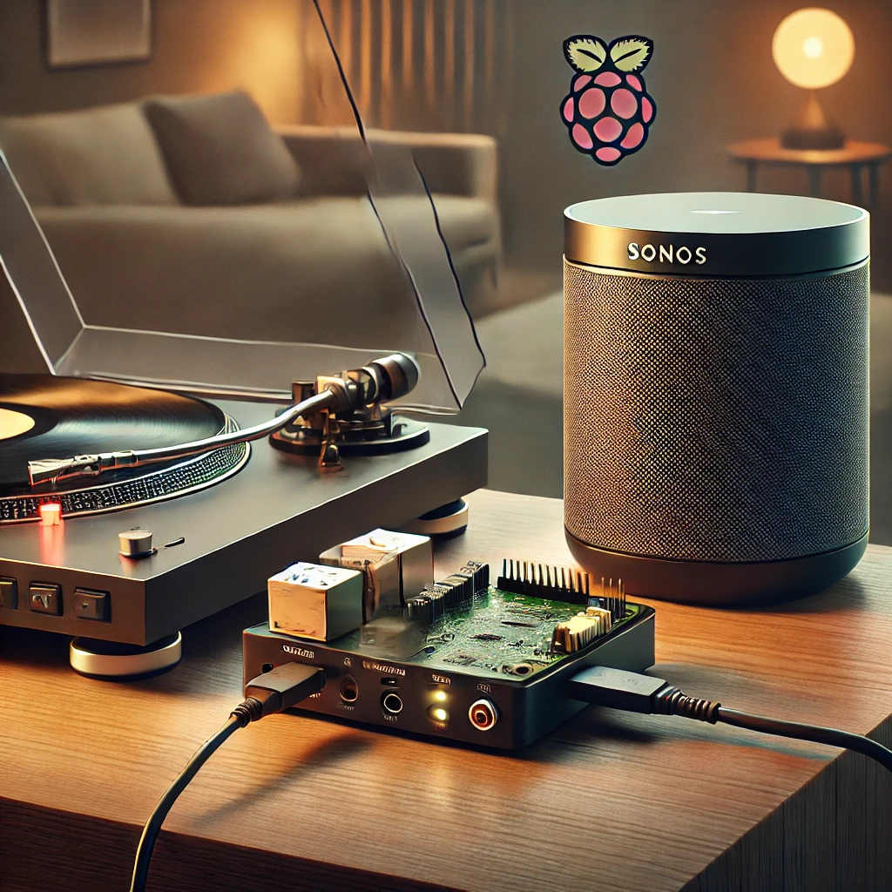

# Turntable2Sonos

Streams your turntable to Sonos device, plug&play.

Put your LP in the player, press play, and music is going to be streamed automatically to your Sonos device.



## Hardware prerequisites

- A Raspberry PI or equivalent; I recommend a version 3 minimum
- An microSD card to install Linux
- A turntable with USB output or an [RCA-to-USB Preamp](https://www.behringer.com/product.html?modelCode=0805-AAF)

## Installation

```
wget https://github.com/kopiro/turntable2sonos/raw/refs/heads/main/build/turntable2sonos-1.0.0.deb
dpkg -i turntable2sonos-1.0.0.deb
```

## Configuration

The configuration file is in `/etc/turntable2sonos.cfg` and it should be pretty explanatory.
